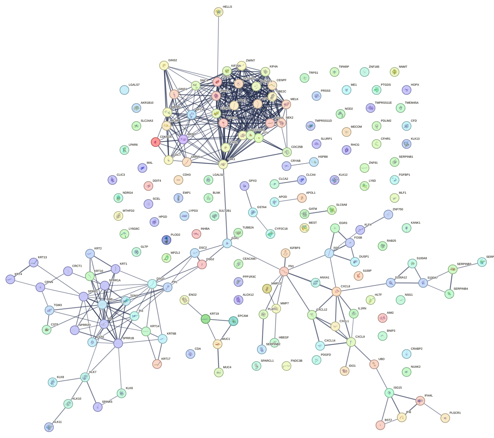

# Assignment--2
## Protein–Protein Interaction (STRING)

- Nodes: 179  
- Edges: 421  
- Avg node degree: 4.7  
- Clustering coefficient: 0.432  
- Expected edges: 52  
- PPI enrichment p-value: < 1e-16  

### Network Figure

